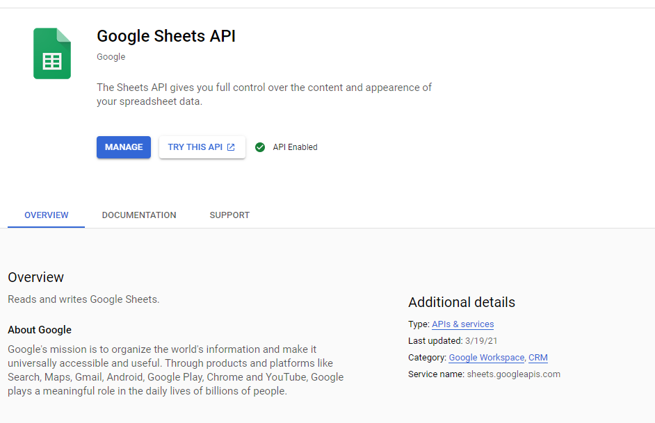

# Trend Micro Interview Question

A Cron Software utility that identifies which tickets have been closed from a google spread sheet data and notifies users via email every week. 
## Getting Started
### Prerequisites
* [Google Cloud Account](https://cloud.google.com/)  - We will be using it to get credentials to use Google Spreadsheet API v4.
* [AWS Account](https://aws.amazon.com/console/) - We will using it for our deployment.
* [Putty](https://www.putty.org/) - We will use it connect to our EC2 instance.
* [Puttygen](https://www.puttygen.com/) - Will use it to convert .pem files to .ppk.
* [Postman](https://www.postman.com/downloads/) - To generate Google Sheet token
### Getting Google Spread Sheet Credentials
#### Enabling Google sheets API
1. Log in to [Google Cloud Console](https://console.cloud.google.com/).
2. Next to **Google Cloud Platform**, click the Down arrow and select a project or create a new one.

3. At the top left corner, click side bar icon and navigate to **[APIs & Services > Dashboard](https://console.cloud.google.com/apis/dashboard)**.
4. Next to **APIs & Services** click on **+ ENABLE APIS AND SERVICES** where you will see a search page.
5. Search for Google Sheets API in the search bar and **ENABLE** it.

#### Create Google API OAuth 2.0 credentials
1. At the top left corner, click side bar icon and navigate to **[APIs & Services > Credentials](https://console.cloud.google.com/apis/credentials)**.
2. Click on **+ CREATE CREDENTIALS** and select OAuth client ID.
3. Select the below options specified in the image and click on create.

4. Once created click ok on the model pop up.
5. Now download the credentials and store somewhere safe for now, make sure to name it **credentials.json**

### Deploying to AWS

#### Launching EC2 instance
1. Log into [AWS Console](https://aws.amazon.com/console/).
2. Navigate to [EC2](https://console.aws.amazon.com/ec2/v2).
3. Click on Launch new instance.

4. Select Ubunutu Server 20.04LTS 64-bit(x86).
5. Select the free tier instance type and proceed with default settings until you reach **Configure Security Group**.

6. Set **Configure Security Group** to the following settings.

7. Proceed to Launch.
8. When pop up model appears create new key and press on **Download Key Pair**.

9. Launch Instance! and voila now make copy your public DNS for later use.

#### Launching Cron App

##### Creating .ppk from .pem via Puttygen
1. Open Puttygen.
2. Click on Load and select the .pem key pair file you downloaded on your EC2 machine launch. it should look something similar to the image below.

3. Click on **Save private key** and save the .ppk key pair file somewhere safe.

##### Connecting to EC2 instance via Putty
1. Open putty.
2. In the hostname field type ubuntu@[YOUR_PUBLIC_DNS] and set port as 22. It should look like image below.

3. Navigate to Connection > SSH > Auth to browse and select the .ppk key pair file we recently converted using puttygen.

4. Save the session for later use and click Open.

##### Installing all tools, code and dependencies
1. When the EC2 terminal opens on putty type the following commands.
    1. sudo apt update
    2. sudo apt install nodejs
    3. sudo apt install npm
    4. git clone https://github.com/ChinguunU/Trend-Micro-Interview-Question.git
    5. cd Trend-Micro-Interview-Question
    6. npm install
    7. nano credentials.json
    8. Copy the contents of the credentials.json file you downloaded from google cloud console and paste it.
    9. Now save and close the file to get back to terminal.
    10. sudo npm install -g
    11. sudo pm2 start index.js
    
    12. sudo pm2 startup
2. Almost done we need to create a token for our program to access google sheets.
    1. Open postman and create a get request with the following 
       http://[PUBLIC_DNS]:8080/getGoogleSheetAuthUrl and hit send.
       You Should receive a url as a response.
    
    2. Follow the link on Chrome confirm and allow all steps and get the token code.
    
    3. Make another request with the following details
       http://[PUBLIC_DNS]/setGoogleToken?code=[CODE_FROM_URL]
       If successful you should receive success as response.
    

#### Testing Cron App
1. Go into EC2 instance via putty and navigate to **Trend-Micro-Interview-Question** directory.
2. Type **ls** you should see token.json has been created.
3. Stop the program: sudo pm2 stop 0
4. Type **nano index.js** to modify when to run cron job.
   Select a time in the near future in Australia/Sydney time.
   Currently in the image it is set for Monday 9 AM. The 
   index 0 for start of week starts on Sunday.

5. Once changed to desired time save and close the index.js file.
6. In the terminal type **sudo pm2 start index.js** to re-deploy.
7. At your desired time you will see the email objects sent to you webhook.

# THANK YOU!
    

    

